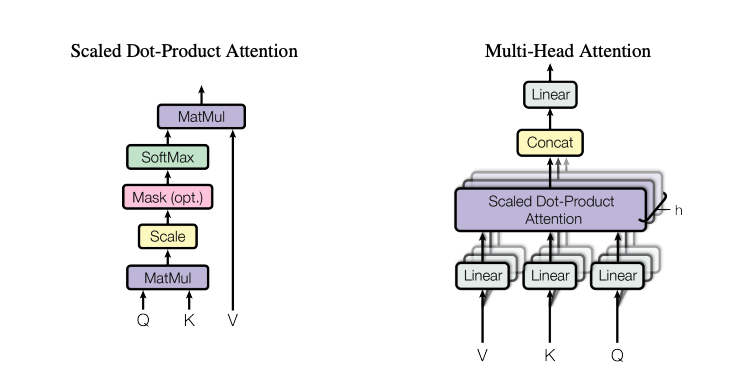

# building-llm

# LLM from Scratch — Hands-On Curriculum (PyTorch)

## Part 0 — Foundations & Mindset
- **0.1** Understanding the high-level LLM training pipeline (pretraining → finetuning → alignment)
- **0.2** Hardware & software environment setup (PyTorch, CUDA/Mac, mixed precision, profiling tools)

```
conda create -n llm_from_scratch python=3.11
conda activate llm_from_scratch
pip install -r requirements.txt
```

# Understanding the transformer architechture
- It is based on encoder-decoder model
- Built entirely on self attention + feedforward network layers (no recurrence and convolution)
- Scales well because attention lets it look at all tokens at once.

## Main Block
### 1. Input Representation
- Tokens->Embeddings: word mapping to dense vectors
- Positional Encodings: Since there's no recurrence/convolution, we inject position info (sine-cosine patterns or learned embeddings)

### 2. Encoder (stacked N times)
- Each encoder layer has:

1. Multi Head Self Attention
- Each token attends to all other tokens in the sequence 
- Multi-head = multiple attention "views" running in parallel

2. Add & Norm (residual connection + layer normalization)

3. Feedforward network
- Two dense layers with non linearity in between
- works independently on each token

4.	Add & Norm again.

Output: contextualized embeddings of input tokens.

### 3. Decoder (stacked N times)
Each decoder layers has:
1. Masked multi head self attention
- prevents tokens from attending to future tokens (casual mask)

2. Cross attention
- Decoder tokens attend to encoder outputs

3.	Feedforward Network.

4.	Residuals + Norm after each step.

Output: representation of target tokens so far, guided by encoder context.

### 4. Output Projection
- Final linear layer → softmax → gives probability distribution over the vocabulary.


# Flow summary
1. Input sentence -> embeddings + positional encodings
2. Encoder layers -> produce context-aware vectors
3. Decoder layers -> use masked self-attention + encoder info to generate next tokens.
4. Prediction -> token-by-token autoregressive decoding



Implementing masked attention so this can be used for decoder.
Implementing simple positional_encoding
